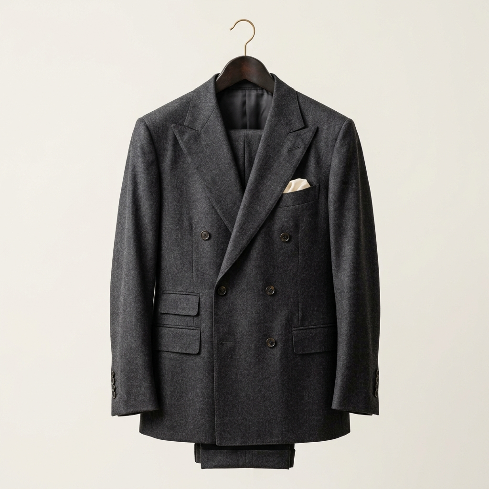
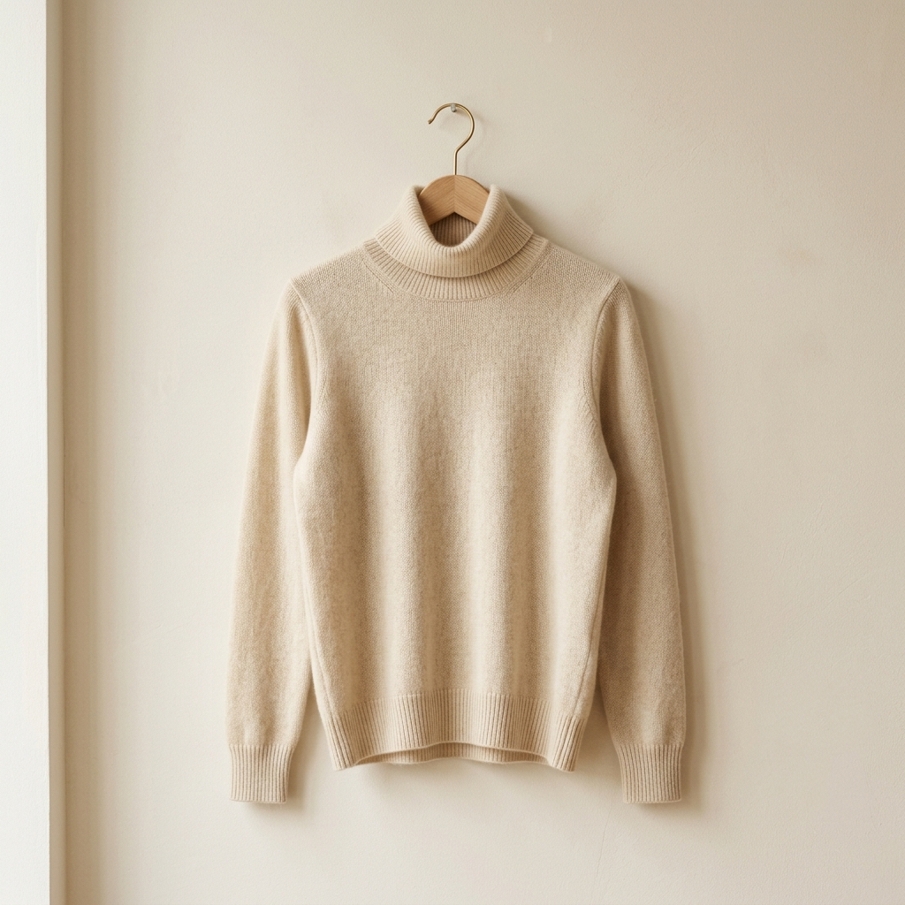
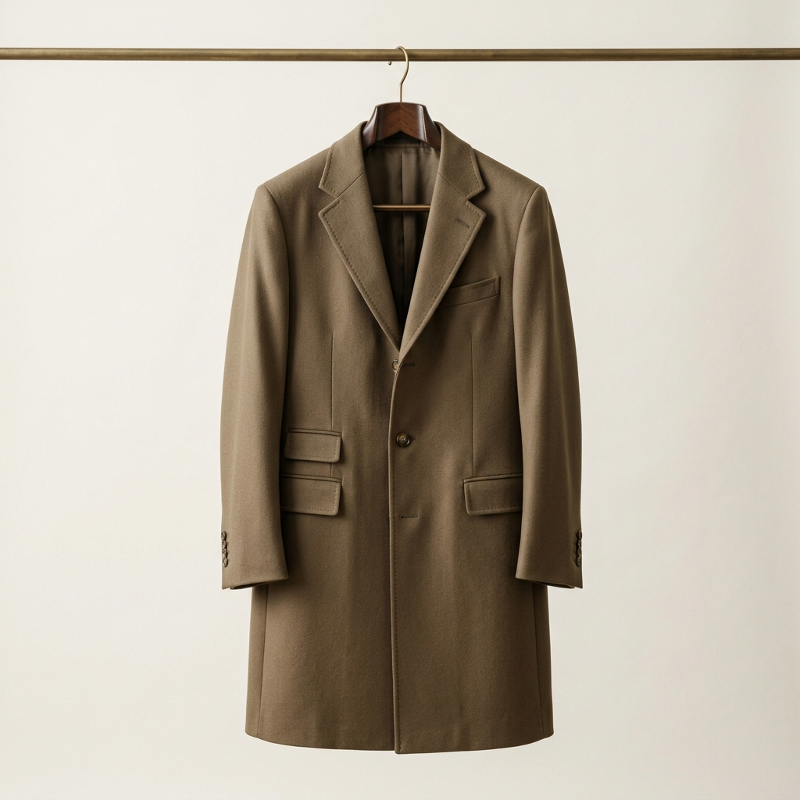
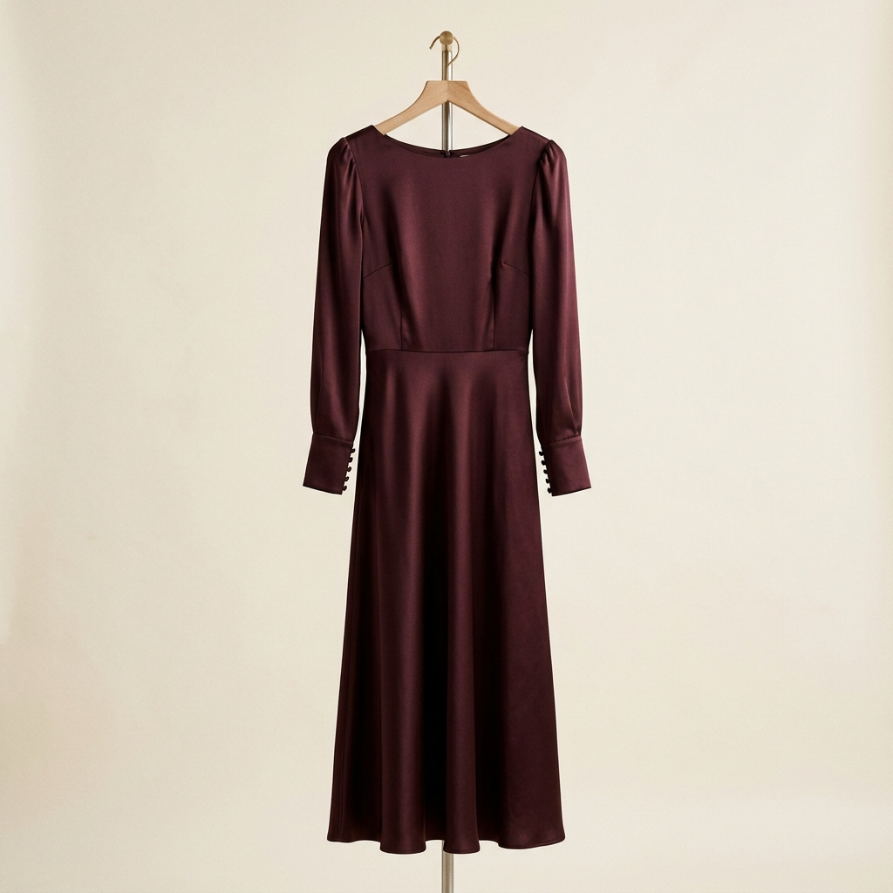
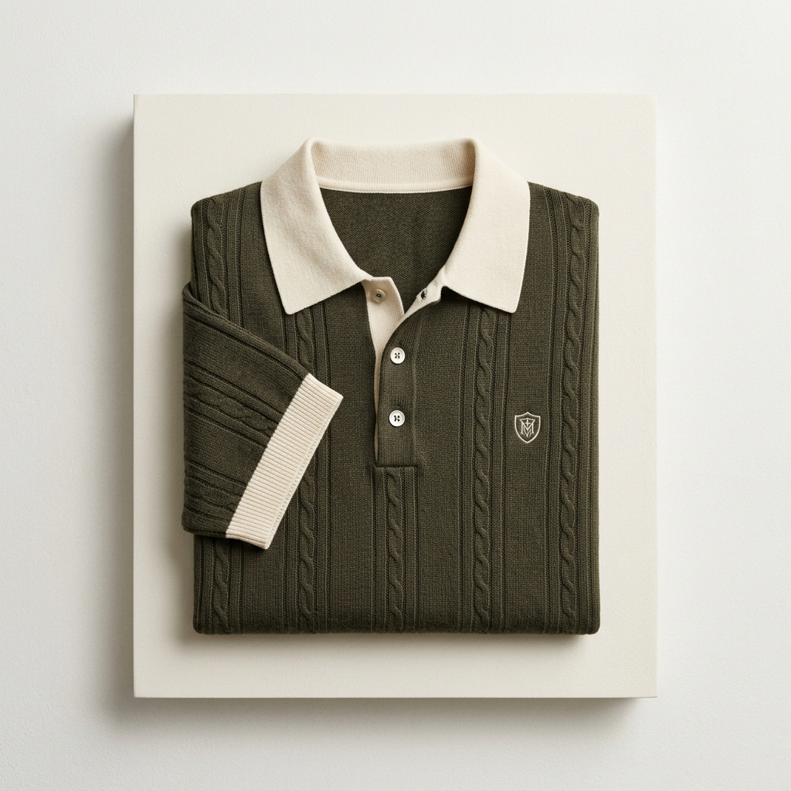

# ABYSS: Minimalist Luxury E-Commerce Plan

This document outlines the final implementation architecture for **ABYSS**, a premier minimalist luxury e-commerce website specializing in the "Old Money" clothing aesthetic. The goal is to create a professional, fully-featured, and visually flawless template engineered to impress high-tier clients.

## Execution Handoff
> [!NOTE]
> This plan is finalized and ready for code execution by Claude Code. Ensure absolutely no professional e-commerce feature is missing.

## Brand Identity & Aesthetic: ABYSS

- **Theme**: Luxury "Old Money" Minimalism.
- **Brand Name**: ABYSS
- **Color Palette**: 
  - **Primary/Dark**: Dark Burgundy (e.g., `#4A0E18` or `#2E0A10`)
  - **Backgrounds/Light Accents**: Dark Khaki Cream/Beige (e.g., `#EFE8D8`, `#D0C5B0`)
- **Typography**: Luxurious serif (*Playfair Display* or *Cinzel*) paired with a pristine sans-serif (*Inter*).

## High-Fidelity Product Line
The catalog features a diverse array of premium clothing. The following base images have been generated to populate the UI mockup:

````carousel

<!-- slide -->

<!-- slide -->

<!-- slide -->

<!-- slide -->

<!-- slide -->

````

## Core Features & Architecture

### 1. The Shopping Experience & Transitions
- **Seamless Page Transitions**: Clicking any product from the catalog grid will trigger a cinematic, fluid spatial transition leading directly to the Product Detail Page (PDP). There should be no harsh page reloads; use Framer Motion `AnimatePresence` and `layoutId` mimicking high-end native app feelings.

### 2. Product Detail Page (PDP)
The PDP must mirror elite fashion houses and include:
- **Immersive Image Gallery**: A sleek interface to view multiple photos of the product (zooms, alternate angles).
- **Luxurious Description**: Deep, elegantly written copy regarding the design inspiration and fabric choice.
- **Sizing Guide**: A beautifully formatted sizing chart modal or dropdown utility.
- **Heritage & Manufacturing Info**: Distinct details denoting origin (e.g., "Meticulously tailored in Milan", "Sourced from highland cashmere").
- **Micro-Interactions**: Buttery-smooth visual feedback upon selecting a size or adding to cart.

### 3. Comprehensive E-Commerce Architecture
- **Global Navigation**: Sticky, transparent-to-opaque navbar with a slide-out cart drawer.
- **Hero & Home**: Striking visual hooks, parallax scrolling banners, and featured categories.
- **Catalog/Shop**: Extensive filtering architecture (Menswear, Womenswear, Accessories, Price, Color) and sorting capabilities.
- **Heritage & Support**: Brand history deep-dive pages and precise contact forms.
- **Mock Checkout**: 100% comprehensive mock checkout flow (Cart -> Information -> Shipping -> Mock Payment -> Confirmation).

### 4. Professional Requisites
*Nothing must be missing.* Include:
- Comprehensive Footer with simulated links for Terms of Service, Privacy Policy, and Shipping/Return protocols.
- Newsletter subscription capture.
- Testimonial carousel from "verified connoisseurs".
- Flawless responsiveness across Mobile, Tablet, and Desktop.

## Technical Stack
- **Framework**: **Next.js (React)** for optimal performance, routing, and robust component architecture.
- **Styling**: **Tailwind CSS**.
- **Animations**: **Framer Motion** (essential for the complex page transitions and layout changes) + **GSAP** (for advanced scroll topography).
